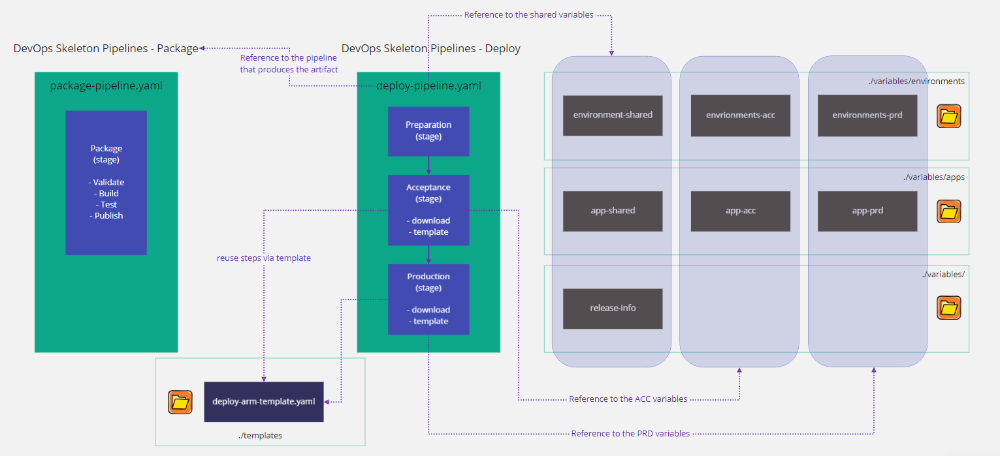

# Skeleton

- [Overview](#overview)
- [Template](#template)

Skeleton template is a general purposes template which provide a structured canvas for developing an application CI/CD pipelines. Skeleton is one of the available [Azure Pipelines templates](../README.MD) available.

## Overview

## Template

This example contains:

- Separated package and deploy pipelines 
- Variables scoped at different levels 
- Deployment steps defined as a template

**Note:** We do not use a template for the packaging steps because it's just only used once so there is no added value for a template.